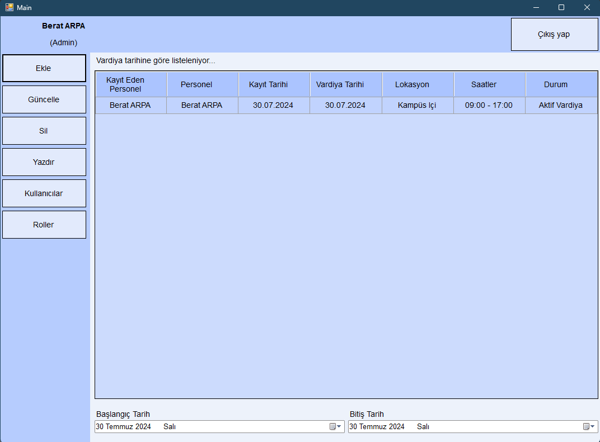

# Employee-Shift-Automation

## About

This project is an automation tool developed to manage employee shifts. It helps streamline the scheduling and management of shifts, ensuring efficient workforce management and reducing manual effort.

## Screenshot


## Features

- **Shift Scheduling**: Automate the scheduling of employee shifts.
- **Shift Management**: Manage and track employee shifts with ease.
- **Notification System**: Notify employees about their shift schedules and changes.
- **Reporting**: Generate reports on shift assignments and employee availability.

## Technologies Used

- **C# WinForms**: Framework used to create the desktop application interface.
- **.NET Framework/Core**: Provides the backend logic and functionality.
- **SQL Database**: Used for storing employee shift data and schedules.
- **Visual Studio**: Integrated development environment used for development.

## Installation

1. **Clone the Repository**:
    ```sh
    git clone https://github.com/BeratARPA/Employee-Shift-Automation.git
    ```
2. **Open with Visual Studio**: Open the project in Visual Studio.
3. **Install Dependencies**: Ensure all necessary dependencies are resolved.
4. **Configure Database**: Set up the SQL database and connection strings in the configuration file.
5. **Build the Project**: Build the solution to ensure proper setup.
6. **Run the Project**: Press F5 to run the project and access the shift management interface.

## Usage

1. **Launch the Application**: Start the application from Visual Studio or the executable.
2. **Configure Shift Schedules**: Set up and manage shift schedules for employees.
3. **Track Shifts**: Monitor and track employee shift assignments.
4. **Generate Reports**: Use the reporting feature to generate shift-related reports.

## Contributing

If you would like to contribute, please fork the repository, create a feature branch, and submit a pull request.

## License

This project is licensed under the MIT License. See the [LICENSE](LICENSE) file for more details.

## Contact

For questions or feedback, feel free to contact me:
- **Email**: [beratarpa@hotmail.com](mailto:beratarpa@hotmail.com)
- **GitHub**: [https://github.com/BeratARPA](https://github.com/BeratARPA)
